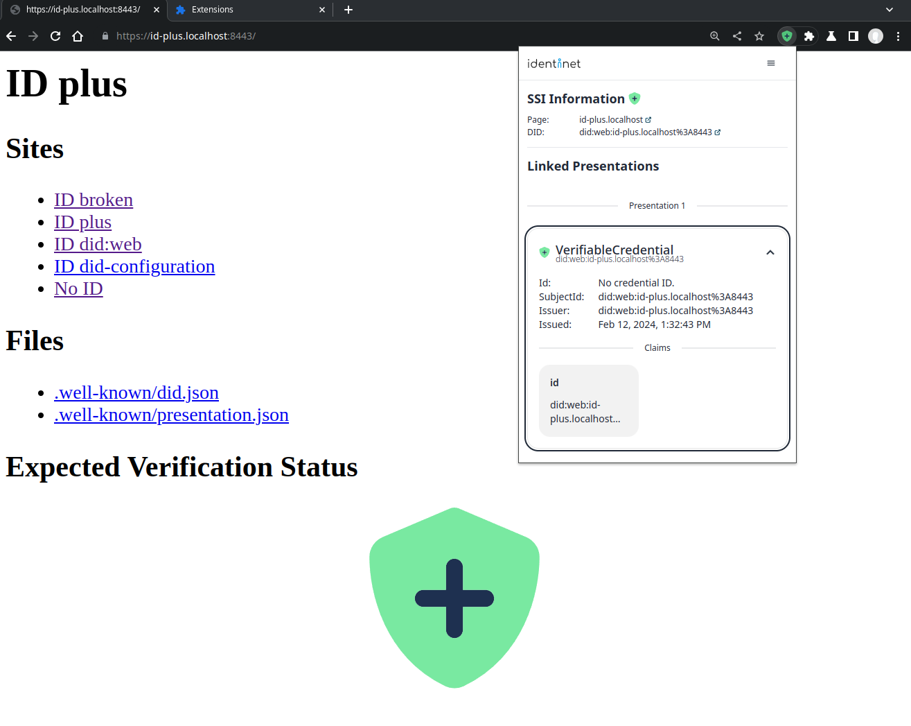

---
# Metadata about the presentation:
title: Public verifiable data for websites, humans, and organizations
author: Brian Richter and Jan Christoph Ebersbach
date: 2024-04-17
keywords: dif linked-vp identifiers discovery verifiable credential presentation did iiw

# Presentation settings:
# URL to favicon
# favicon: /favicon.svg
favicon: https://identinet.github.io/slidesdown-theme/images/favicon.svg
# Theme, list of supported themes: https://github.com/slidesdown/slidesdown.github.io/tree/main/vendor/reveal.js/dist/theme
# theme: white
theme: https://identinet.github.io/slidesdown-theme/identinet.css
# Code highlighting theme, list of supported themes: https://github.com/slidesdown/slidesdown.github.io/tree/main/vendor/highlight.js
highlight-theme: tokyo-night-dark

# Show progress bar
progress: true
# Show controls
controls: false
# Center presentation
center: true
# Create separate pages for fragments
pdfSeparateFragments: false
# Full list of supported settings: https://revealjs.com/config/ or
# https://github.com/hakimel/reveal.js/blob/master/js/config.js
# UnoCSS styling: https://unocss.dev/interactive/ and https://tailwindcss.com/docs
# Icons: https://icones.js.org and https://unocss.dev/presets/icons
---

# Public verifiable data for websites, humans, and organizations

DIF Linked Verifiable Presentation Specification by Brian Richter and Jan Christoph Ebersbach.

<!-- generated with
!deno run --allow-read --allow-write https://deno.land/x/remark_format_cli@v0.2.0/remark-format.js --maxdepth 2 %
-->

## Agenda

1. [Who am I <div class="i-fa6-solid-question color-[var(--lightPrimary1)] inline-block mb-[-0.2em]"></div>](#who-am-i-div-classi-fa6-solid-question-color-var--lightprimary1-inline-block-mb--02emdiv)
2. [Public Data](#public-data)
3. [DIF Linked Verifiable Presentation Spec](#dif-linked-verifiable-presentation-spec)
4. [How to use it on the Web?](#how-to-use-it-on-the-web)
5. [Demo](#demo)
6. [Special Thanks](#special-thanks)

## Who am I <div class="i-fa6-solid-question color-[var(--lightPrimary1)] inline-block mb-[-0.2em]"></div>

<div class="grid grid-cols-[1fr_4fr] gap-4 justify-center justify-items-start content-center items-start text-start">
<div class="i-fa6-solid-user color-[var(--lightPrimary1)] justify-self-end"></div> Jan Christoph or JC
<div class="i-fa6-solid-graduation-cap color-[var(--lightPrimary1)] justify-self-end"></div> Computer Scientist
<div class="i-fa6-solid-rocket color-[var(--lightPrimary1)] justify-self-end"></div> Founder identinet
<div class="i-fa6-solid-earth-europe color-[var(--lightPrimary1)] justify-self-end"></div> Bremen, Germany
<div class="i-fa6-solid-heart-pulse color-[var(--lightSecondary1)] justify-self-end"></div> FLOSS, Kubernetes, Blockchain,<br>Self-Sovereign Identity
</div>

## Public Data

notes:

- What is the linked-vp spec about? Verifiable Data and Verifiable Credentials
- Something we come across every day
  - On Websites
  - On the walls of company headquarters
- Organizations and people claim all kinds of things on websites and social
  networks
- Legally relevant information is presented to us, like terms of use, privacy
  policies, imprint data etc.
- And I ask myself? Is this information authorized, is this information
  authentic and does is it unmodified?
- Someone put the information on the website, only the org has the password, so
  it must be an authorized piece of data

### Examples of org public data

<div class="grid grid-cols-2 items-center">

- Organizational data on imprint pages
- Terms of Use, Privacy Policies
- Partner logos
- Certifications
- Endorsed initiatives and services

<figure>
  
  <figcaption><small>bund.de</small></figcaption>
</figure>

</div>

### Examples of personal public data

<div class="grid grid-cols-2 items-center">

- contact details
- Work experience
- Education
- Achievements and Awards

<figure>
  
  <figcaption><small>linkedin.com</small></figcaption>
</figure>

</div>

### Challenges

<div class="grid grid-cols-2">
<div>
<span class="underline">Malicious activities</span>

- Fraud
- Misrepresentation
- Misattribution

</div>
<div>
<span class="underline">High effort</span>

- Duplication of data in processes
- Discoverability
- Verification

</div>
</div>

notes:

- All the claims that are made online, come with a lot of challenges
- Malicious uses of data are decreasing the experience on the web for everyone
- Figuring out malicious schemes is difficult and it starts with first of all
  discovering data and verifying data to make sense of its contents
- The good thing is that with DIDs and VCs we have technologies that provide
  identity and data attribution and are well suited for the decentralized web

## DIF Linked Verifiable Presentation Spec

[identity.foundation/linked-vp](https://identity.foundation/linked-vp)

Authors: Brian Richter, Markus Sabadello, Jan Christoph Ebersbach

notes:

- This got me thinking about how to DIDs and VCs could be used to make public
  data verifiable
- In the Identifiers and Discovery WG of DIF
- Brian Richter, Markus Sabadello and I teamed to create the Linked Verifiable
  Presentation specification

### What is specified?

- Just a new type for service endpoints, `LinkedVerifiablePresentation`

```json [3,9-11]
"context": {
  "https://www.w3.org/ns/did/v1",
  "https://identity.foundation/linked-vp/contexts/v1"
}
...
"service": [
  {
    "id": "did:example:123#foo",
    "type": "LinkedVerifiablePresentation",
    "serviceEndpoint":
      "https://foo.example.com/presentation.json"
  },
```

notes:

- The spec just defines a new type for service endpoints
- And requires the link to point to a Verifiable Presentation document

### What is Not specified?

<table class="font-size-8">
  <thead><tr><th>Topic</th><th>Alternative</th></tr></thead>
  <tbody>
    <tr class="fragment"><td>Private communication channel</td><td>DIDComm & OpenID4VC</td></tr>
    <tr class="fragment"><td>Protocol for retrieving presentations</td><td>HTTP, IPFS, ...</td></tr>
    <tr class="fragment"><td>Storage medium for presentations</td><td>File system, database, blockchain</td></tr>
    <tr class="fragment"><td>Service API for storing, modifying and deleting presentations</td><td>Credential Registry</td></tr>
    <tr class="fragment"><td>How to connect a DID to a website</td><td>did:web, did:webs, did:tdw, did:dns, .well-known DID Configuration</td></tr>

</tbody>
</table>

<!-- <div class="grid grid-cols-2 font-size-8 items-start "> -->

<!---->

<!-- <div class="border border-solid">Private communication channel</div> -->

<!-- <div class="border border-solid">DIDComm & OpenID4VC</div> -->

<!-- <div class="border border-solid">Protocol for retrieving presentations</div> -->

<!-- <div class="border border-solid">HTTP, IPFS, ...</div> -->

<!-- <div class="border border-solid">Storage medium for presentations</div> -->

<!-- <div class="border border-solid">File system, database, blockchain</div> -->

<!-- <div class="border border-solid">Service API for storing, modifying and deleting presentations</div> -->

<!-- <div class="border border-solid">Credential Registry</div> -->

<!-- <div class="border border-solid">How to connect a DID to a website</div> -->

<!-- <div class="border border-solid">did:web, did:dns, -->

<!---->

<!-- [DIF Well Known DID Configuration](https://identity.foundation/.well-known/resources/did-configuration/) -->

<!---->

<!-- </div> -->

<!---->

<!-- </div> -->

notes:

- Any DID method is supported, as long as it supports the modification of
  service endpoints. TODO: maybe add this to the spec?
- The protocol for retrieving the presentations is not specified and up for
  implementors to define. HTTP is an obvious choice, ipfs could also be used for
  additional intergrity guarantees.
- Any storage medium can be used in the background, from a file on the
  filesystem to databases and blockchains
- The spec does not define how presentations actually get to the location and
  how they are updated.
  - The Credential Registry specification by EECC/GS1 defines a comprehensive
    service API. The two specs are not yet compatible
  - Our aim was to focus the spec on publicly connecting verifiable data a DID
    so that it can be retrieved by end users/interested parties, rather than
    providing a full service specifiction for implementors
- The spec also doesn't define how a DID is connected to a website

## How to use it on the Web?

<small>

1. Link DID to website
   <!-- .element: class="fragment" -->
2. Combine multiple Verifiable Credentials into a Verifiable Presentation
   <!-- .element: class="fragment" -->
3. Publish signed presentation at URL <!-- .element: class="fragment" -->
4. Extend DID document with service endpoint of type
   LinkedVerifiablePresentation <!-- .element: class="fragment" -->
5. Website visitors will be able to discover and verify data
   <!-- .element: class="fragment" -->

</small>

```json [3,9-11]
"context": {
  "https://www.w3.org/ns/did/v1",
  "https://identity.foundation/linked-vp/contexts/v1"
}
...
"service": [
  {
    "id": "did:example:123#foo",
    "type": "LinkedVerifiablePresentation",
    "serviceEndpoint":
      "https://foo.example.com/presentation.json"
  },
```

<!-- .element: class="fragment" -->

notes:

-
- Why do we need it when there are DIDComm and OpenID4VC? What would the world
  be like if we had public verifiable data?
- Seeing it in action
  - Implementing it, just embed the simple context, add to DID, issue and share
    credentials
  - Public credential sharing has limitations that people need to be aware of
- Use Cases people came up with

### Use Cases

<div class="fragment">
  <div class="i-fa6-solid-triangle-exclamation color-[var(--lightSecondary1)] h-[1em] w-[1em] inline-block"></div>
  Not suitable for all data!
</div>

- Verifiable imprint page
- Automated Masterdata Management
- Verifiable partner endorsements / memberships
- Decentralized business network à la LinkedIn
- Digital Product Passports

## Demo

<figure class="w-[70%] m-auto"}>
  
  <figcaption><small>identinet Browser Plugin</small></figcaption>
</figure>

## Special Thanks

- Decentralized Identity Foundation
- DIF Identifiers & Discovery Working Group
- Simon Mang

---

<h2>Thank you!</h2>

<!-- - For which use cases would you like to use the technology? -->

<!-- - Which challenges do you see? -->

<!-- - What is missing to make the technology useful for your use case? -->

---

<h2>Contact</h2>

- Jan Christoph Ebersbach: jc@identinet.io
- Brian Richter: brian@aviary.tech

---

<h2>References</h2>

- identinet-plugin: <https://github.com/identinet/identinet-plugin>
- DIF Linked-VP specification: <https://identity.foundation/linked-vp/>
- DIF .well-known DID Configuration
  <https://identity.foundation/.well-known/resources/did-configuration/>
- Presentation Slides: <https://github.com/identinet/presentations>
