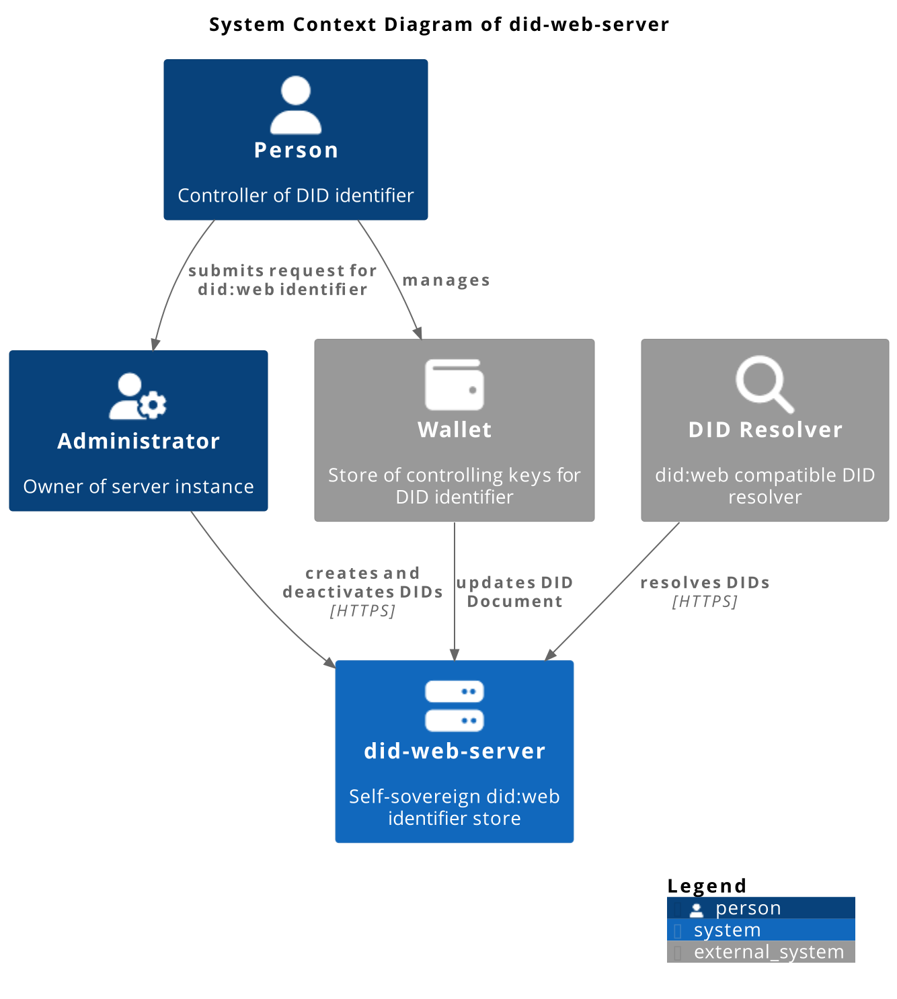
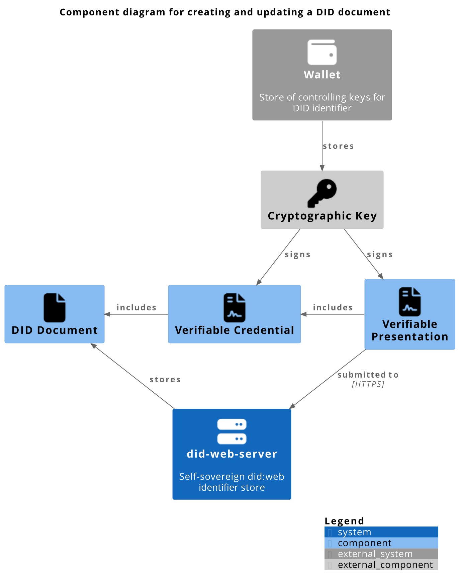

---
# Metadata about the presentation:
title: Self-Sovereign did:web
author: Jan Christoph Ebersbach
date: 2024-06-20
keywords: did identifiers web linked-vp ssi

# Presentation settings:
# URL to favicon
# favicon: /favicon.svg
favicon: https://identinet.github.io/slidesdown-theme/images/favicon.svg
# Theme, list of supported themes: https://github.com/slidesdown/slidesdown.github.io/tree/main/vendor/reveal.js/dist/theme
# theme: white
theme: https://identinet.github.io/slidesdown-theme/identinet.css
# Code highlighting theme, list of supported themes: https://github.com/slidesdown/slidesdown.github.io/tree/main/vendor/highlight.js
highlight-theme: tokyo-night-dark

# Show progress bar
progress: true
# Show controls
controls: false
# Center presentation
center: true
# Create separate pages for fragments
pdfSeparateFragments: false
# Full list of supported settings: https://revealjs.com/config/ or
# https://github.com/hakimel/reveal.js/blob/master/js/config.js
# UnoCSS styling: https://unocss.dev/interactive/ and https://tailwindcss.com/docs
# Icons: https://icones.js.org and https://unocss.dev/presets/icons
---

# Self-Sovereign did:web

Introducing did-web-server

<!-- generated with
!deno run --allow-read --allow-write https://deno.land/x/remark_format_cli@v0.3.2/remark-format.js --maxdepth 2 %
-->

<!-- ## Agenda -->

## did:web is great 😄

- Simple to deploy
- Wide library support
- Modifiable DID Documents

### did:web is not so great 😔

- Administrative security model
- Not very self-sovereign <!-- .element: class="fragment" -->

## Meet did-web-server

<figure>
  
  <figcaption>System Context</figcaption>
</figure>

### How to update DID doc

<figure>
  
  <figcaption>System Components</figcaption>
</figure>

### Potential extensions

- did:tdw support
- linked-vp data publishing
- status list publishing
- governance lists
- webhooks for notification

---

<h2>Thank you!</h2>

<!-- - For which use cases would you like to use the technology? -->

<!-- - Which challenges do you see? -->

<!-- - What is missing to make the technology useful for your use case? -->

---

<h2>Contact</h2>

- Jan Christoph Ebersbach: jc@identinet.io

---

<h2>References</h2>

- Presentation Slides: <https://github.com/identinet/presentations#ssi-didweb>
- did-web-server: <https://dws.identinet.io>
