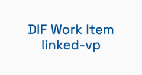

# [identinet](https://identinet.io) presentations
[GitHub Repository](https://identinet/presentations)

| Date | Title | Language | Presenter | Location | Slides | Source |
| --- | --- | --- | --- | --- | --- | --- |
| 2025-11-02 | <a name="251102_Hackerspace_NixOS_Introduction" href="#251102_Hackerspace_NixOS_Introduction">What is Nix and do I need it?</a> | en | <a href="https://www.linkedin.com/in/jcebersbach/">Jan Christoph Ebersbach</a> | <a href="https://www.hackerspace-bremen.de/">Hackerspace Bremen e.V.</a> |  | <a href="https://github.com/identinet/presentations/tree/main/251102_Hackerspace_NixOS_Introduction">251102_Hackerspace_NixOS_Introduction</a> |
| 2024-06-20 | <a name="240620_Self-Sovereign_did-web" href="#240620_Self-Sovereign_did-web">Self-Sovereign did:web</a> | en | <a href="https://www.linkedin.com/in/jcebersbach/">Jan Christoph Ebersbach</a> | <a href="https://diceurope.org/">Digital Identity unConference Europe 2024</a> |  | <a href="https://github.com/identinet/presentations/tree/main/240620_Self-Sovereign_did-web">240620_Self-Sovereign_did-web</a> |
| 2024-06-19 | <a name="240619_DICE_linked-vp" href="#240619_DICE_linked-vp">What if your website was verifiable?</a> | en | <a href="https://www.linkedin.com/in/jcebersbach/">Jan Christoph Ebersbach</a> | <a href="https://diceurope.org/">Digital Identity unConference Europe 2024</a> |  | <a href="https://github.com/identinet/presentations/tree/main/240619_DICE_linked-vp">240619_DICE_linked-vp</a> |
| 2024-06-19 | <a name="240619_DICE_DID_Traits" href="#240619_DICE_DID_Traits">Tell me about your identifier</a> | en | <a href="https://www.linkedin.com/in/jcebersbach/">Jan Christoph Ebersbach</a> | <a href="https://diceurope.org/">Digital Identity unConference Europe 2024</a> |  | <a href="https://github.com/identinet/presentations/tree/main/240619_DICE_DID_Traits">240619_DICE_DID_Traits</a> |
| 2024-04-16 | <a name="240416_IIW_linked-vp" href="#240416_IIW_linked-vp">Public verifiable data for websites, humans, and organizations</a> | en | <a href="https://www.linkedin.com/in/jcebersbach/">Jan Christoph Ebersbach</a> and <a href="https://www.linkedin.com/in/brianrichter">Brian Richter</a> | <a href="https://internetidentityworkshop.com/">Internet Identity Workshop XXXVIII</a> |  | <a href="https://github.com/identinet/presentations/tree/main/240416_IIW_linked-vp">240416_IIW_linked-vp</a> |
| 2024-03-02 | <a name="240311_chainist" href="#240311_chainist">Veröffentlichte Daten, aber bitte verifizierbar!</a> | de | <a href="https://www.linkedin.com/in/jcebersbach/">Jan Christoph Ebersbach</a> | <a href="https://www.linkedin.com/company/chainist">Chainist Emerging Tech Community</a> |  | <a href="https://github.com/identinet/presentations/tree/main/240311_chainist">240311_chainist</a> |
| 2024-02-26 | <a name="240226_DIF_linked-vp" href="#240226_DIF_linked-vp">DIF Work Item Linked-VP</a> | en | <a href="https://www.linkedin.com/in/jcebersbach/">Jan Christoph Ebersbach</a> | <a href="https://github.com/decentralized-identity/linked-vp">DIF Work Item Linked-VP - WG Identifiers & Discovery</a> |  | <a href="https://github.com/identinet/presentations/tree/main/240226_DIF_linked-vp">240226_DIF_linked-vp</a> |
