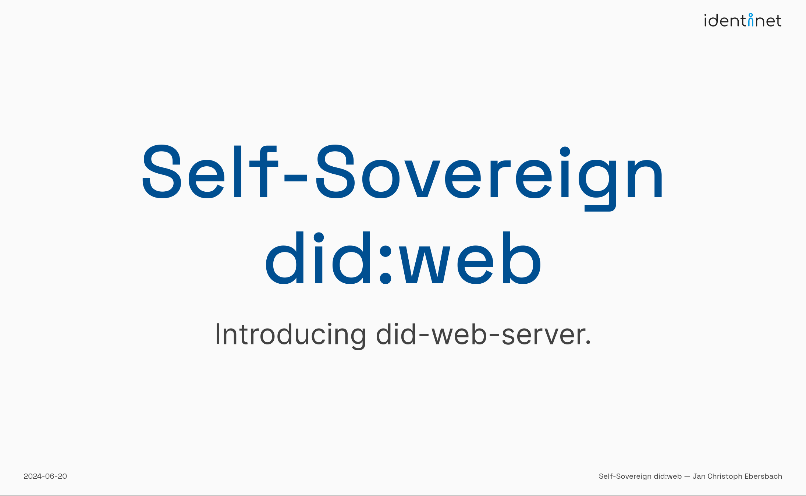
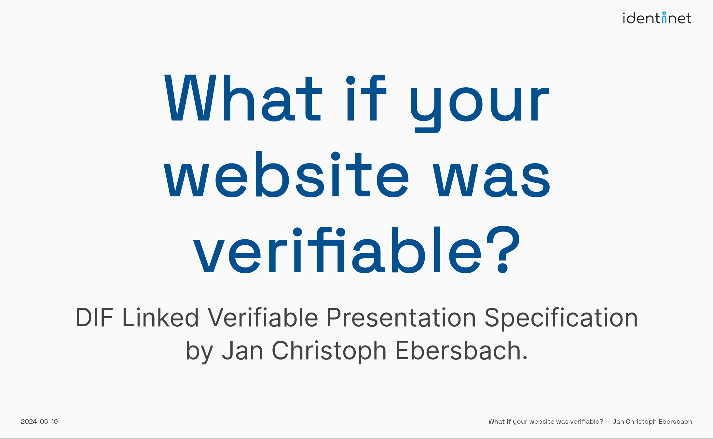
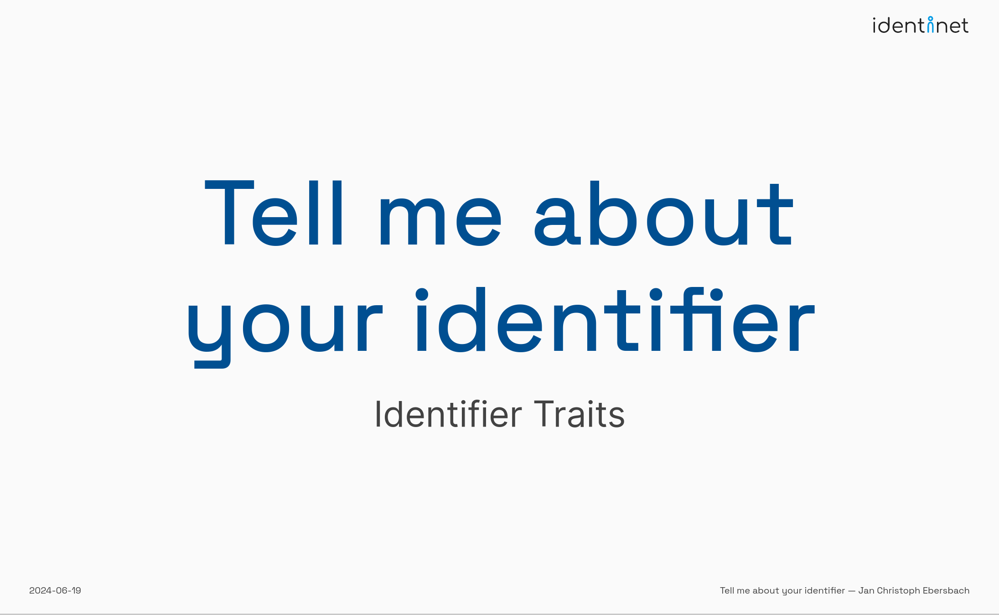
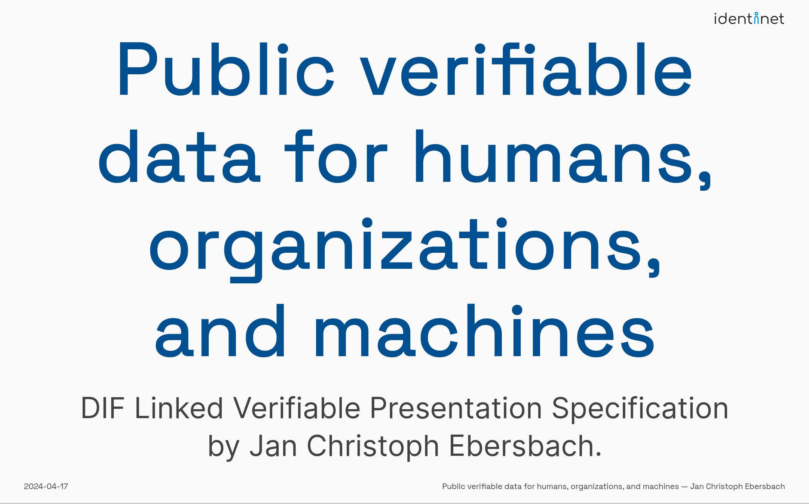

# identinet presentations

| Date       | Title                                                                 | Presenter                                                                                            | Place                                                                                                       | Slides                                                                                                                                                                                                          | Source                                                           |
| ---------- | --------------------------------------------------------------------- | ---------------------------------------------------------------------------------------------------- | ----------------------------------------------------------------------------------------------------------- | --------------------------------------------------------------------------------------------------------------------------------------------------------------------------------------------------------------- | ---------------------------------------------------------------- |
| 2024-06-20 | <a name="ssi-didweb">Self-Sovereign did:web</a>                       | [Jan Christoph Ebersbach][linkedin-jc]                                                               | [Digital Identity unConference Europe 2024](https://diceurope.org/)                                         |                        | [240620_Self-Sovereign_did-web](./240620_Self-Sovereign_did-web) |
| 2024-06-19 | <a name="verifiable-website">What if your website was verifiable?</a> | [Jan Christoph Ebersbach][linkedin-jc]                                                               | [Digital Identity unConference Europe 2024](https://diceurope.org/)                                         |                          | [240619_DICE_linked-vp](./240619_DICE_linked-vp)                 |
| 2024-06-19 | <a name="did-traits">Tell me about your identifier</a>                | [Jan Christoph Ebersbach][linkedin-jc]                                                               | [Digital Identity unConference Europe 2024](https://diceurope.org/)                                         |                               | [240619_DICE_DID_Traits](./240619_DICE_DID_Traits)               |
| 2024-04-16 | Public verifiable data for websites, humans, and organizations        | [Jan Christoph Ebersbach][linkedin-jc] and [Brian Richter](https://www.linkedin.com/in/brianrichter) | [Internet Identity Workshop XXXVIII](https://internetidentityworkshop.com/)                                 |  | [240416_IIW_linked-vp](./240416_IIW_linked-vp)                   |
| 2024-03-02 | Veröffentlichte Daten, aber bitte verifizierbar!                      | [Jan Christoph Ebersbach][linkedin-jc]                                                               | [Chainist Emerging Tech Community](https://www.linkedin.com/company/chainist)                               |                          | [240311_chainist](./240311_chainist)                             |
| 2024-02-26 | DIF Work Item Linked-VP                                               | [Jan Christoph Ebersbach][linkedin-jc]                                                               | [DIF Work Item Linked-VP - WG Identifiers & Discovery](https://github.com/decentralized-identity/linked-vp) |                                         | [240226_DIF_linked-vp](./240226_DIF_linked-vp)                   |

[linkedin-jc]: https://www.linkedin.com/in/jcebersbach/ "LinkedIn - Jan Christoph Ebersbach"
